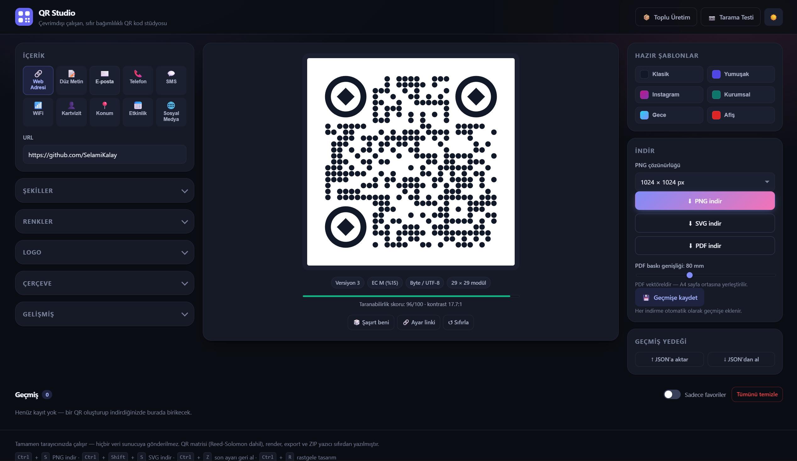

# QR Studio

**English** | [Türkçe](README.tr.md)

**Live demo:** https://selamikalay.github.io/qr-studio/



A QR code studio with logo, shape, color and frame customization that exports to
**PNG / SVG / PDF** and keeps its history in the browser. The user interface is in
Turkish.

> **Zero dependencies.** No npm packages, no CDN, no backend. The QR matrix
> (including Reed-Solomon error correction), the SVG renderer, the PDF writer and the
> ZIP writer were all written from scratch in this project. It even works by
> downloading the files and double-clicking; no internet required.

---

## Running

With the bundled dependency-free server (only Node is required, no npm install):

```bash
node dev-server.js
```

Then open `http://localhost:8000` in your browser. For a different port:
`node dev-server.js 5500`

Alternatives:

```bash
npx serve .
```

```bash
python -m http.server 8000
```

> You can also open `index.html` directly by double-clicking it. Only the **camera
> scan test** requires `http://localhost` because of browser security rules.

---

## Features

### Content types
Web address · Plain text · E-mail · Phone · SMS · WiFi · Contact card (vCard) ·
Location (geo) · Event (VEVENT) · Social media shortcuts

Each type defines its own form schema and standard QR payload in
`js/content-types.js`; delimiter escaping for WiFi and vCard (`\;` `\,` `\:`) is
applied correctly.

### Visual customization
- **Dot shape:** square, rounded, drop, dot, diamond, classy — smart corner rounding
  based on neighboring modules (adjacent modules merge, outward-facing corners are rounded)
- **Eye frame:** square, rounded, circle, drop, reversed drop
- **Eye ball:** square, rounded, circle, diamond, drop
- All three corners can be styled individually
- **Color:** solid or gradient (linear/radial, adjustable angle), separate color for the eyes
- **Transparent background**, rounded background corners, adjustable quiet zone (margin)
- **Frame:** text band at the bottom/top, badge, plain border + free text

### Logo
- PNG / JPG / SVG / WEBP upload (drag and drop supported)
- Limited to **at most 30%** of the QR area, centered automatically
- Adding a logo switches the error correction level to **H (30%)** and locks it
- Optional backdrop + rounded corners

### Scannability score
Every change produces a 0–100 score with explained warnings based on WCAG contrast
ratio, use of inverted colors (light pattern on dark background), narrow quiet zone,
logo size, transparent background and content density.

### Export
| Format | How it is produced |
|---|---|
| **PNG** | SVG → `Image` → `canvas` → `toBlob`. 512 / 1024 / 2048 / 4096 or custom resolution. Transparency is preserved. |
| **SVG** | The generated SVG as a `Blob`. Vector, infinitely scalable. |
| **PDF** | **True vector output.** Drawing paths are translated one-to-one into the PDF content stream; gradients become a PDF shading pattern and the frame text is embedded with Helvetica. Placed in the center of an A4 page at the chosen width in mm. |

### Batch generation
Upload a CSV (or paste lines) → all codes are generated with the current design →
downloaded as a single `.zip`. The ZIP file (including CRC32) is written from
scratch; the STORE method is used since PNG is already compressed.

CSV format — first column is the content, second column (optional) is the file name label:

```csv
icerik;etiket
https://example.com/a;Campaign A
https://example.com/b;Campaign B
```

The delimiter (`,` `;` tab) is detected automatically and quoted fields are supported.

### History
Every generated code is saved to **IndexedDB** along with its settings and a small
preview. Clicking a card reopens it for editing with its full design and form fields.
Favorites, deletion, clear-all and `.json` backup/restore are available. The last
used settings are also kept in `localStorage` and restored on startup.

### Other
- Dark / light mode (follows the system preference, choice is remembered)
- Presets: Classic, Soft, Instagram, Corporate, Night, Poster
- "Surprise me" — a random harmonious design
- Share settings as a link (encoded in the `#` fragment of the URL)
- Camera scan test (in browsers that support `BarcodeDetector`)

### Keyboard shortcuts
| Shortcut | Action |
|---|---|
| `Ctrl` + `S` | Download PNG |
| `Ctrl` + `Shift` + `S` | Download SVG |
| `Ctrl` + `Z` | Undo last setting change |
| `Alt` + `R` | Random design |
| `Esc` | Close the open dialog |

---

## Android app (APK)

The same code base runs inside a native Android shell. No Gradle, Android Studio or
npm is needed — the APK is built directly with the Android SDK tools
(`aapt2 → javac → d8 → zipalign → apksigner`).

### Build

```bash
powershell -ExecutionPolicy Bypass -File build-apk.ps1
```

Output: `QR-Studio.apk` in the project root (~120 KB).

Requirements: JDK 17+ (`JAVA_HOME`) and the Android SDK (`ANDROID_HOME`) with
`build-tools` and a `platforms/android-XX`. The build runs under a temporary ASCII
path (aapt2 on Windows cannot open paths containing Turkish characters).

### Installing on a phone

Once on the phone: tap **Settings → About phone → Build number** 7 times, then enable
**Settings → Developer options → USB debugging**. Connect the cable, accept the
permission prompt on the phone, then:

```bash
powershell -ExecutionPolicy Bypass -File install-apk.ps1 -Launch
```

The script finds the device, prints the model/Android/WebView version, installs and
launches the APK. Add `-Logs` to follow logcat after installation.

You can also copy the APK to the phone and install it from a file manager (this
requires allowing installs from unknown sources).

### What happens on the native side

| Topic | Solution |
|---|---|
| Serving pages | Assets are served from `assets/www` through a virtual **https** origin via `shouldInterceptRequest`. With `file://`, IndexedDB would be blocked and history would not work. |
| Internet permission | **None.** All requests are handled inside the app; the APK cannot access the network. |
| Downloads | WebView does not support `blob:` downloads. Files are passed to the native side through a JS bridge in 512 KB chunks and written to the Downloads folder via **MediaStore** (no permission needed on Android 10+). |
| Logo / CSV picking | System file picker via `onShowFileChooser`. |
| Camera | `onPermissionRequest` + runtime CAMERA permission. Because the virtual origin is https, `getUserMedia` and `BarcodeDetector` meet the secure-context requirement — the scan test works better on the phone than on desktop. |
| Back button | Closes an open dialog first, then exits on double press. |
| Theme | Window and status bar colors follow the system dark mode. |
| Icon | `tools/make-icons.js` writes the PNGs from scratch using Node's zlib; the adaptive icon background is a vector gradient. |

### Signing

The first build generates `android/qrstudio.keystore` (password: `qrstudio`).
**Keep this file** — updates must be signed with the same key, otherwise you cannot
install over the existing app without uninstalling it first. This is a local
development key; create a separate release key for the Play Store.

---

## Project structure

```
.
├── index.html
├── css/
│   └── style.css
├── js/
│   ├── qr-encoder.js       # Matrix generation: mode selection, Reed-Solomon, block interleaving, masking
│   ├── qr-renderer.js      # Matrix → drawing commands → SVG (shapes, gradient, logo, frame)
│   ├── qr-export.js        # PNG / SVG / PDF export
│   ├── content-types.js    # Content type schemas and formatters
│   ├── storage.js          # IndexedDB + localStorage
│   ├── history-ui.js       # History list UI
│   ├── batch.js            # CSV parsing + ZIP writer + batch generation
│   └── app.js              # State management, form, live preview, events
├── assets/fonts/           # (optional) local font files
├── dev-server.js           # Dependency-free local static server
│
├── android/                # Android app
│   ├── AndroidManifest.xml
│   ├── java/com/qrstudio/app/MainActivity.java
│   └── res/                # icons, themes, strings
├── tools/
│   └── make-icons.js       # PNG icon generator (with Node zlib)
├── build-apk.ps1           # APK builder (without Gradle)
├── install-apk.ps1         # Installs to a phone
└── README.md
```

---

## How it works

### 1. Matrix generation — `qr-encoder.js`
Written according to ISO/IEC 18004:

1. **Mode selection** — the content is analyzed as numeric / alphanumeric / byte
   (UTF-8) and the most efficient mode is chosen (`8675309` takes half the space in
   numeric mode compared to byte mode).
2. **Version selection** — the smallest version (1–40) that fits the content is found.
3. **Bit stream** — mode indicator + character count + data + terminator +
   `0xEC / 0x11` padding bytes.
4. **Reed-Solomon** — error correction codewords are produced over GF(256)
   (primitive polynomial `0x11D`) by synthetic division with the generator polynomial.
5. **Block interleaving** — data and EC blocks are interleaved in the standard order.
6. **Matrix** — finder patterns, separators, timing and alignment patterns, format
   (BCH 15,5) and version (BCH 18,6) information are placed; data is written in the
   zigzag order.
7. **Masking** — all 8 masks are applied and scored with the 4 penalty rules from the
   ISO standard; the mask with the lowest score is chosen.

Verification: tested against the 32-entry format information table, known version
BCH values, a zero Reed-Solomon remainder and an **encode-decode round trip up to full
capacity for versions 1–40**.

### 2. Rendering — `qr-renderer.js`
The matrix is converted into a list of drawing commands of the form
`{type, path, color}`. All paths use only the **M / L / C / Z** commands (arcs are
converted to cubic Béziers) — so the same list can be turned into both SVG and a PDF
content stream. Finder patterns are drawn as rings with `fill-rule="evenodd"`.

### 3. Export — `qr-export.js`
The PDF flips the page coordinate system with the matrix `[s 0 0 -s ox oy] cm` and
uses the design coordinates directly; text is flipped back upright with
`1 0 0 -1 x y Tm`; the gradient is defined as a `PatternType 2` shading pattern
carrying the same matrix. The xref table is computed with byte offsets.

---

## Known limitations

- **PDF font:** Because the embedded Helvetica (WinAnsi) is used, the letters
  `ğ ş İ ı` in the frame text are written as `g s I i` in the PDF. PNG and SVG exports
  have no such limitation.
- **Camera scan test** requires the `BarcodeDetector` API, which is usually missing in
  desktop Chrome on Windows. The UI tells you when this is the case — the most
  realistic test is a phone camera anyway.
- **PDF with a transparent background** is not supported; the PDF always prints the
  background color.
- The logo is embedded in the PDF as JPEG (transparency is filled with the chosen
  backdrop color).
- System fonts are used (to avoid depending on a CDN). To use your own font, place it
  in `assets/fonts/` and declare it with `@font-face` in `css/style.css`.

---

## Privacy

No data is sent to any server. Content, logos and history are stored only in your own
browser's IndexedDB and localStorage. Keep in mind that the password in a WiFi QR code
is stored in the QR as **plain text** — this is how the QR standard works, so be
careful when sharing it.
